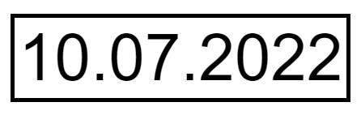
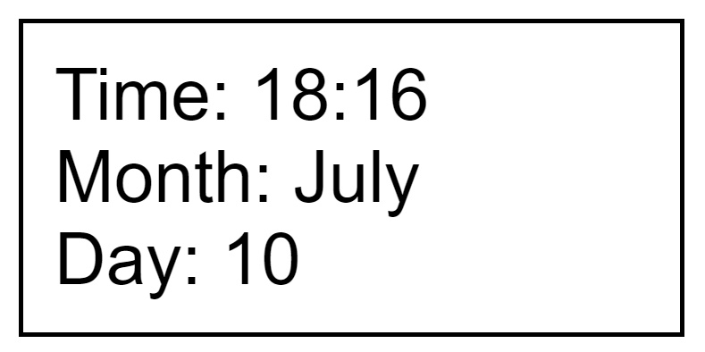

<hr>

🗓 You can use this to display the time or the date. 🗓

##

The first step is to paste this link in the head `<head>`
```html
<script src="https://cdn.jsdelivr.net/gh/philiphoney/Moody-Date/version/v1.0/moodydate.js"></script>
```
##

# Custom Dates

With the custom elements you can take out what you need.

## moodyTime
With `moodyTime` you can display the time.
```html
<span class="moodyTime"></span>
```
`09:41`

## moodyTimeWithSeconds
With `moodyTimeWithSeconds` you can display the time with the seconds.
```html
<span class="moodyTimeWithSeconds"></span>
```
`09:41:00`

## moodyFullDate
The `moodyFullDate` allows you to display the full date.
```html
<span class="moodyFullDate"></span>
```
`01.03.2022`

## moodyDateDay
With `moodyDateDay` you can display today.
```html
<span class="moodyFullDate"></span>
```
`01`

## moodyDateMonth and moodyDateMonthNumber
With `moodyDateMonth` and `moodyDateMonthNumber` you can display the month as a name or as a number.
```html
<span class="moodyDateMonth"></span>

<span class="moodyDateMonthNumbe"></span>
```
`March` or `03`

## moodyDateYear
The `moodyDateYear` can show you the year.
```html
<span class="moodyDateYear"></span>
```
`2022`

## moodyDateWeekday
With `moodyDateWeekday` you can display the day of the week.
```html
<span class="moodyDateWeekday"></span>
```
`Su`

# Designs

## Design 1

```html
<span class="moodyDesigns-1"></span>
```


## Design 2

```html
<span class="moodyDesigns-2"></span>
```

